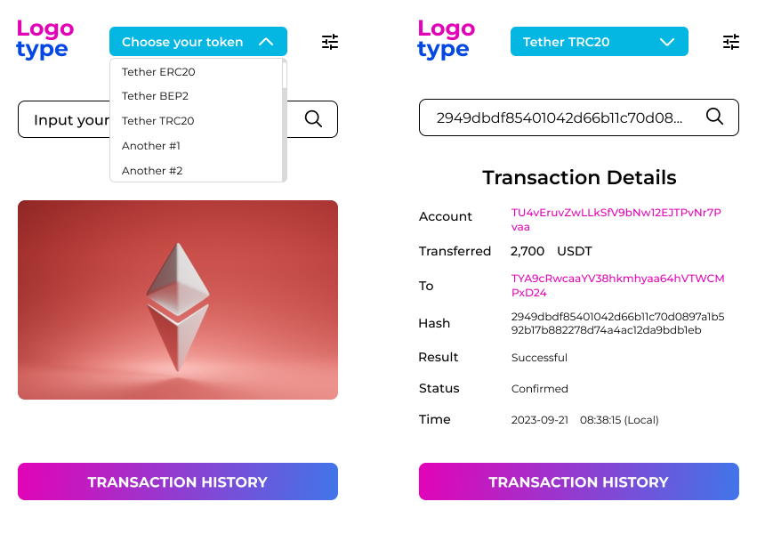
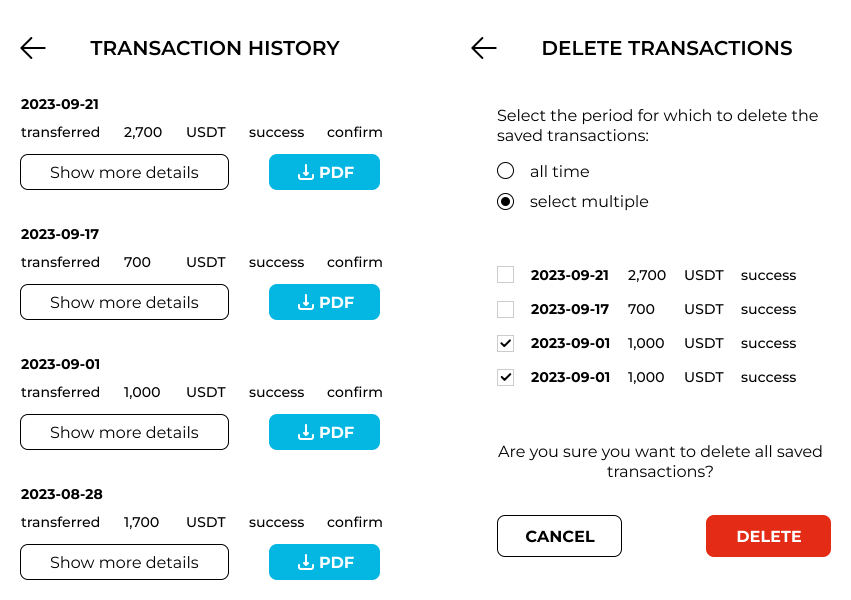
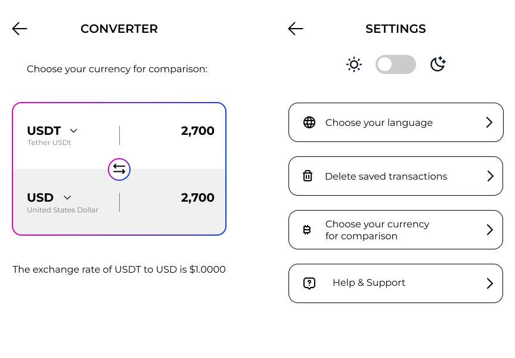
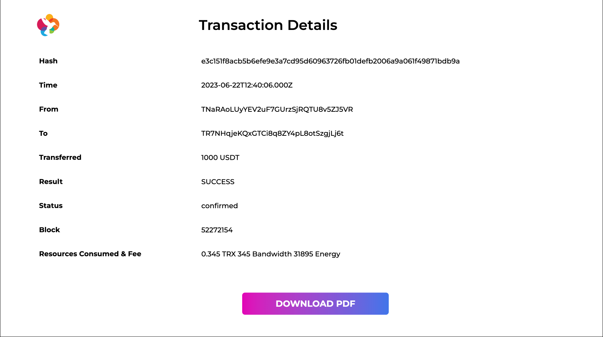

# Transaction Scanner

<p align="center">
  
</p>

# Project Description

Transaction Scanner is a modern application designed to provide you with transaction details, enabling you to save and access your transactions effortlessly. Additionally, it offers the capability to download transaction information in PDF format, serving as a digital receipt for your records.

Key Features:
* Transaction data retrieval
* Transaction saving and deletion
* Transaction download in PDF format
* Currency and coin converter
* Customizable background theme colors and language settings


<p align="center">
  
</p>


<p align="center">
  
</p>


<p align="center">
  
</p>

<p align="center">
  
</p>


Utilized Technologies:
* Vue.js (Composition API)
* Pinia Store
* TypeScript
* Tailwind
* Vite

Project Future: There is a desire to create a tracker that will operate on various exchanges and alert users about suspicious transactions (using a database of suspicious wallets) or if the selected network (for example, TRC20) does not match the entered address.

# How to install

* Download project.
```bash
  git clone https://github.com/yhuhuza/transaction-scanner.git
````

* Go to the downloaded directory and execute the code below to install dependencies.
```bash
  npm install
````

* Build the project.
```bash
  npm run build_v3
````

* Then, in the dist directory, you can find the build. Upload it to your browser, and after that, you can use the application.

# Contact Me

LinkedIn - https://www.linkedin.com/in/nikolai-maidan-7b4a96245/ <br>
Telegram - @yhuhuza <br>
Email - nikolai.maidan.08@gmail.com <br>
